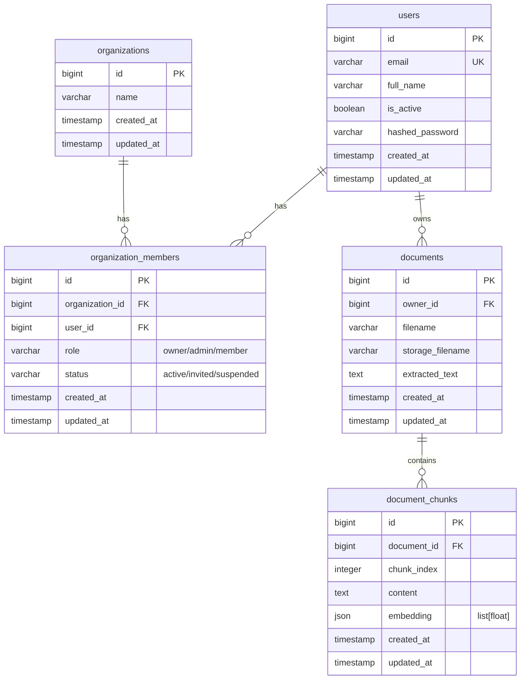

# AI Knowledge Base

A secure, AI-powered knowledge base backend built with **FastAPI**. This application allows users to upload PDF documents, automatically extract their text, generate semantic chunk-level embeddings locally, and query them using localized similarity search or a Retrieval-Augmented Generation (RAG) chat pipeline powered by Google Gemini.

---

## Table of Contents

- [Problem Statement](#problem-statement)
- [Key Features](#key-features)
- [Tech Stack](#tech-stack)
- [Architecture Overview](#architecture-overview)
- [RAG Ingestion & Retrieval Pipeline](#rag-ingestion--retrieval-pipeline)
- [Request Flow Diagram](#request-flow-diagram)
- [Authentication & User Isolation Flow](#authentication--user-isolation-flow)
- [PDF Document Ingestion Flow](#pdf-document-ingestion-flow)
- [Chat & Question-Answer Flow](#chat--question-answer-flow)
- [Database Overview](#database-overview)
- [Docker Architecture](#docker-architecture)
- [Project Structure](#project-structure)
- [Local Setup Instructions](#local-setup-instructions)
- [Environment Variables](#environment-variables)
- [Running with Docker Compose](#running-with-docker-compose)
- [Running Tests](#running-tests)
- [Main API Endpoints with Example Requests/Responses](#main-api-endpoints-with-example-requestsresponses)
- [Security Considerations](#security-considerations)
- [Current Limitations](#current-limitations)
- [Future Improvements](#future-improvements)
- [Deployment Notes](#deployment-notes)
- [License](#license)

---

## Problem Statement

Organizations and users deal with massive volumes of unstructured data in PDFs (such as manuals, financial reports, or design logs). Accessing this knowledge via traditional keyword search is slow and lacks semantic understanding. Additionally, using public LLM services directly poses data privacy risks, and typical vector database architectures add substantial infrastructure overhead.

This application provides a **user-isolated backend** that parses, chunks, and embeds documents locally using a lightweight embedding model. The embeddings are stored in a standard relational database as JSON arrays, permitting fast, owner-restricted, in-memory cosine similarity matching. Relevant context is then safely passed to Google Gemini, guaranteeing that generative responses are strictly grounded in user-owned data without cross-user data leakage.

---

## Key Features

- **Strict User Document Isolation:** Document records, database queries, search operations, and physical storage folders are bound strictly to the document owner (`owner_id`). Data is only accessible through JWT-derived user identity.
- **Organization Bootstrapping:** User registration automatically provisions the user, their initial organization entity, and sets up an active `owner` membership record.
- **On-Device Embedding Generation:** Uses `sentence-transformers/all-MiniLM-L6-v2` locally to generate 384-dimensional vector embeddings, removing external API calls from the embedding step.
- **Context-Grounded RAG Chat:** Integrates with a **configurable Google Gemini model** via the `google-genai` SDK, configured with system instructions that prevent hallucination and restrict answers to retrieved context.
- **Relational Vector Storage:** Stores float-array embeddings in a standard relational database schema using a JSON field, bypassing the need for an external vector database for localized user-scoped search.
- **Automated Non-Overlapping PDF Processing:** Extracts text via PyMuPDF (`fitz`), normalizes whitespace, and segments text into non-overlapping word blocks sized to the embedding model's context window (`CHUNK_SIZE_WORDS = 200`).
- **Clean Architecture & Layered Design:** Rigid controller-service-repository design pattern for testability, clean exception propagation, and predictable transactional boundaries.

---

## Tech Stack

- **Framework:** [FastAPI](https://fastapi.tiangolo.com/) (Asynchronous Python Web Framework)
- **Database:** [PostgreSQL](https://www.postgresql.org/) (via [SQLAlchemy](https://www.sqlalchemy.org/) async ORM and `asyncpg` driver; SQLite supported for local testing)
- **Database Migrations:** [Alembic](https://alembic.sqlalchemy.org/)
- **PDF Extraction:** [PyMuPDF (fitz)](https://pymupdf.readthedocs.io/)
- **Embedding Generation:** [SentenceTransformers](https://www.sbert.net/) (`all-MiniLM-L6-v2` locally cached)
- **LLM Integration:** [Google Gen AI SDK](https://github.com/google/generative-ai-python) (configurable Gemini model, e.g. `gemini-2.5-flash`)
- **Testing:** [Pytest](https://docs.pytest.org/) (utilizing `pytest-asyncio` and an isolated SQLite/aiosqlite database)
- **Security:** JWT (JSON Web Tokens via PyJWT), Argon2id password hashing (via `pwdlib`, backed by `argon2-cffi`)
- **Deployment & Containerization:** Docker (Multi-stage build), Docker Compose

---

## Architecture Overview

The system is constructed with a decoupled, layer-based backend layout:

```
┌────────────────────────────────────────────────────────┐
│                        FastAPI                         │  (HTTP Controllers/Routers)
└──────────────────────────┬─────────────────────────────┘
                           │  Validates DTO schemas & parses requests
                           ▼
┌────────────────────────────────────────────────────────┐
│                     Service Layer                      │  (Orchestrates business logic, RAG, LLM calls)
└──────────────────────────┬─────────────────────────────┘
                           │  Drives the transaction boundaries
                           ▼
┌────────────────────────────────────────────────────────┐
│                    Repository Layer                    │  (Translates domain intent to SQLAlchemy queries)
└──────────────────────────┬─────────────────────────────┘
                           │  Operates on the AsyncSession with owner filtering
                           ▼
┌────────────────────────────────────────────────────────┐
│                 PostgreSQL / SQLite                    │  (Stores entities, metadata, and JSON vectors)
└───────────────────────────┴────────────────────────────┘
```

- **Controller/Router:** Handlers validate schema payloads (using Pydantic v2) and delegate to services. They catch domain-specific errors and raise corresponding HTTP exceptions.
- **Service Layer:** Executes transactions, generates embeddings, extracts text, calls external APIs, and orchestrates workflows.
- **Repository Layer:** Encapsulates raw database queries. Every document and chunk read/write operation is explicitly scoped to the authenticated `owner_id`.

---

## RAG Ingestion & Retrieval Pipeline

```text
┌──────────────────────┐
│      PDF Upload      │
└──────────┬───────────┘
           │
           ▼
┌──────────────────────┐
│   Text Extraction    │  (PyMuPDF / fitz)
└──────────┬───────────┘
           │
           ▼
┌──────────────────────┐
│       Chunking       │  (Contiguous ~200-word blocks, no overlap)
└──────────┬───────────┘
           │
           ▼
┌──────────────────────┐
│      Embeddings      │  (all-MiniLM-L6-v2, 384-dim vectors)
└──────────┬───────────┘
           │
           ▼
┌──────────────────────┐
│       Storage        │  (PostgreSQL/SQLite JSON column)
└──────────────────────┘

                         ┌──────────────────────┐
                         │       Question       │
                         └──────────┬───────────┘
                                    │
                                    ▼
                         ┌──────────────────────┐
                         │  Question Embedding  │  (all-MiniLM-L6-v2)
                         └──────────┬───────────┘
                                    │
                                    ▼
┌──────────────────────┐ ┌──────────┴───────────┐
│     Storage (DB)     │─┤ Similarity Retrieval │  (In-memory cosine calculation)
└──────────────────────┘ └──────────┬───────────┘
                                    │
                                    ▼
                         ┌──────────────────────┐
                         │   Relevant Chunks    │  (Top-K sorted content context)
                         └──────────┬───────────┘
                                    │
                                    ▼
                         ┌──────────────────────┐
                         │        Gemini        │  (configurable model API call)
                         └──────────┬───────────┘
                                    │
                                    ▼
                         ┌──────────────────────┐
                         │        Answer        │  (Strictly grounded response)
                         └──────────────────────┘
```

---

## Request Flow Diagram

```text
 Client        FastAPI Router      Auth Dependency      Service Layer        DB & Retrieval         Gemini LLM
   │                 │                    │                   │                     │                   │
   │───[ Request ]──>│                    │                   │                     │                   │
   │   (JWT Token)   │───[ Auth Token ]──>│                   │                     │                   │
   │                 │   (Validate JWT)   │                   │                     │                   │
   │                 │<───[ User Object ]─│                   │                     │                   │
   │                 │                                        │                     │                   │
   │                 │───────[ Invoke Service Method ]───────>│                     │                   │
   │                 │        (e.g., chat_service)            │                     │                   │
   │                 │                                        │───[ Fetch Chunks ]─>│                   │
   │                 │                                        │    (Filtered owner) │                   │
   │                 │                                        │<───[ Chunks List ]──│                   │
   │                 │                                        │                     │                   │
   │                 │                                        │───[ Cosine Match ]──│                   │
   │                 │                                        │     (Local Math)    │                   │
   │                 │                                        │                     │                   │
   │                 │                                        │───────[ Prompt ]───────────────────────>│
   │                 │                                        │       (Context + System Instruction)    │
   │                 │                                        │<──────[ Response ]──────────────────────│
   │                 │                                        │                     │                   │
   │                 │<───────[ Return ChatResponse ]─────────│                     │                   │
   │<──[ Response ]──│                                        │                     │                   │
   │  (JSON DTO)     │                                        │                     │                   │
```

---

## Authentication & User Isolation Flow

1. **User Registration (`POST /api/v1/auth/register`):**
   - Accepts email, password (min 8 chars), optional full name, and organization name.
   - Creates a `User` (password hashed with Argon2id via `pwdlib`), an `Organization`, and an `OrganizationMember` with `role="owner"` and `status="active"` inside a single atomic transaction.
2. **User Authentication (`POST /api/v1/auth/login`):**
   - Verifies email and password against the stored Argon2id hash.
   - Generates an OAuth2-compliant signed JWT bearer token containing the user ID as subject (`sub`) and an expiration timestamp (default: 30 minutes).
3. **User-Scoped Dependency (`Depends(get_current_user)`):**
   - Intercepts requests with `Authorization: Bearer <token>`.
   - Decodes JWT signature, extracts `sub`, loads the authenticated `User`, and injects it into route handlers.
4. **Document Scoping:**
   - Document operations (creation, listing, detail view, deletion, semantic search, RAG chat) enforce `owner_id == current_user.id` at the query layer.

---

## PDF Document Ingestion Flow

1. **Upload Request (`POST /api/v1/documents/upload`):**
   - Validates `.pdf` extension and checks file size against `MAX_UPLOAD_SIZE_MB` (default: 10MB).
2. **Physical Storage:**
   - Saves the raw PDF on disk under `uploads/<owner_id>/<uuid4>.pdf`. The generated UUID filename prevents path traversal and hides physical storage structures.
3. **Text Extraction:**
   - PyMuPDF (`fitz`) opens the PDF and extracts all text page by page.
4. **Contiguous Chunking:**
   - Text is split on whitespace into contiguous, non-overlapping blocks of ~200 words (`CHUNK_SIZE_WORDS = 200`), sized to fit the embedding model's 256-token context window so no chunk text is silently truncated at embedding time.
5. **Vector Embedding:**
   - Each chunk's text is passed to `EmbeddingService` (`all-MiniLM-L6-v2`), generating a 384-element float array.
6. **Persistence & Rollback:**
   - `Document` metadata and `DocumentChunk` records (content + JSON vector array) are committed in a single transaction.
   - If extraction or database insertion fails, any saved file on disk is deleted cleanly.

---

## Chat & Question-Answer Flow

1. **Query Submission (`POST /api/v1/chat`):**
   - Takes a question string and a retrieval limit parameter `limit` (default: 5, ge: 1, le: 100).
2. **User-Scoped Vector Search:**
   - Embeds the query string into a 384-dimensional vector using `EmbeddingService`.
   - Fetches all indexed document chunks belonging to `current_user.id` from the database.
   - Computes cosine similarity in memory:
     $$\text{similarity} = \frac{A \cdot B}{\|A\| \|B\|}$$
   - Ranks chunks in descending order and picks the top `limit` results.
3. **LLM Generation:**
   - Concatenates retrieved chunk text into a context block.
   - Passes system instruction to the configured Google Gemini model:
     > *"You answer ONLY from the supplied document context. If the answer is not present in the supplied context, reply exactly: 'I don't know.' Do not use outside knowledge."*
4. **Response Payload:**
   - Returns the LLM answer alongside `sources` citations containing `document_id` and `chunk_index`.

---

## Database Overview

The application utilizes SQLAlchemy with declarative models inheriting from `ORMBase` (`IdMixin` with `BIGINT Identity`, `TimestampMixin` with timezone-aware `created_at`/`updated_at`).



---

## Docker Architecture

- **Multi-Stage Dockerfile (`Dockerfile`):**
  - **Builder Stage (`builder`):** Creates `/opt/venv`, installs dependencies from `requirements-lock.txt` (using PyTorch CPU wheels to minimize size), and pre-downloads the `all-MiniLM-L6-v2` transformer model into `/opt/models`.
  - **Runtime Stage (`runtime`):** Copies `/opt/venv` and `/opt/models`, installs `libgomp1`, creates non-root user `appuser` (UID/GID 10001), exposes port 8000, and specifies a standard library liveness healthcheck.
- **Docker Compose Stack (`docker-compose.yml`):**
  - `postgres`: PostgreSQL 16-alpine with persistent volume `postgres_data` and `pg_isready` healthcheck.
  - `migrate`: One-shot container executing `alembic upgrade head` after `postgres` is healthy.
  - `api`: FastAPI application starting only after `migrate` completes successfully.

---

## Project Structure

```
├── .dockerignore
├── .env.example
├── .gitignore
├── Dockerfile               # Multi-stage Dockerfile with baked model weights
├── README.md                # Project documentation
├── alembic/                 # Database migration environment
│   └── versions/            # Versioned migration scripts
├── alembic.ini              # Alembic configuration
├── app/
│   ├── api/                 # FastAPI router endpoints (auth, chat, documents, health, users)
│   ├── config/              # Pydantic BaseSettings management
│   ├── core/                # JWT encoding/decoding and Argon2id password hashing utilities
│   ├── db/                  # Database engine, session, declarative bases, mixins
│   ├── dependencies/        # FastAPI dependency injection providers
│   ├── models/              # SQLAlchemy ORM models
│   ├── repositories/        # Database access objects with owner scoping
│   ├── schemas/             # Pydantic v2 DTO request/response schemas
│   ├── services/            # Domain services (auth, chat, chunking, document, embeddings, llm, pdf, search, similarity)
│   └── main.py              # Application setup and router registration
├── docker/
│   └── entrypoint.sh        # Uvicorn container entrypoint script
├── docker-compose.yml       # Production-like Compose stack (Postgres + Migrate + API)
├── pytest.ini               # Pytest configuration file
├── requirements-lock.txt    # Fully locked dependency manifest
├── requirements.txt         # Primary python dependencies
└── tests/
    ├── conftest.py                     # Fixtures, SQLite engine, and dependency overrides/mocks
    ├── test_chunking_similarity.py     # Unit tests for the pure RAG primitives
    ├── test_auth_and_chat_paths.py     # Auth + chat/search failure-path integration tests
    └── test_integration.py             # End-to-end integration test suite
```

---

## Local Setup Instructions

### Prerequisites

- Python 3.12+
- PostgreSQL (running locally or accessible via network)
- Google Gemini API key (optional for server start; required for `/chat` endpoint)

### Steps

1. **Clone the Repository:**
   ```bash
   git clone <repository_url>
   cd ai-knowledge-base
   ```

2. **Create and Activate Virtual Environment:**
   ```bash
   python3 -m venv .venv
   source .venv/bin/activate
   ```

3. **Install Dependencies:**
   ```bash
   pip install --upgrade pip
   pip install -r requirements.txt
   ```

4. **Environment Setup:**
   ```bash
   cp .env.example .env
   ```
   Edit `.env` to configure `DATABASE_URL` and `JWT_SECRET`.

5. **Run Migrations:**
   ```bash
   alembic upgrade head
   ```

6. **Start Application:**
   ```bash
   PYTHONPATH=. uvicorn app.main:app --reload
   ```
   Access OpenAPI documentation at `http://127.0.0.1:8000/docs`.

---

## Environment Variables

Settings are managed via `pydantic-settings` in `app/config/settings.py`:

| Environment Variable | Description | Type / Default |
| :--- | :--- | :--- |
| `DATABASE_URL` | SQLAlchemy async connection string (must use `postgresql+asyncpg` for Postgres) | `str` *(Required)* |
| `JWT_SECRET` | Secret key for signing HS256 JWT tokens | `str` *(Required)* |
| `JWT_ALGORITHM` | Cryptographic algorithm for JWT signatures | `str` (Default: `"HS256"`) |
| `JWT_ACCESS_TOKEN_EXPIRE_MINUTES` | Access token lifespan in minutes | `int` (Default: `30`) |
| `UPLOAD_DIR` | Directory root for document storage | `str` (Default: `"uploads"`) |
| `GEMINI_API_KEY` | Key for Google GenAI SDK | `str \| None` (Default: `None`) |
| `GEMINI_MODEL` | Gemini LLM model identifier (configurable) | `str` (Default: `"gemini-2.5-flash"`) |
| `MAX_UPLOAD_SIZE_MB` | Maximum allowed PDF size in megabytes | `int` (Default: `10`) |
| `APP_NAME` | Name displayed in OpenAPI docs | `str` (Default: `"AI Knowledge Base"`) |
| `APP_VERSION` | Application semver string | `str` (Default: `"0.1.0"`) |
| `DEBUG` | Enables SQLAlchemy query echo | `bool` (Default: `False`) |
| `PORT` | Container/Uvicorn server bind port (used by `entrypoint.sh`) | `str` (Default: `"8000"`) |

---

## Running with Docker Compose

1. Prepare `.env`:
   ```bash
   cp .env.example .env
   ```
2. Start containers:
   ```bash
   docker compose up --build
   ```
   The stack provisions PostgreSQL, applies migrations via `alembic upgrade head`, and launches the FastAPI API server on port 8000.

---

## Running Tests

Tests run asynchronously against an isolated SQLite file (`test_ai_knowledge_base.db`) with `SentenceTransformers` embeddings and `Google GenAI` calls mocked, so the whole suite completes in a few seconds. Coverage spans pure-function unit tests (chunking, cosine similarity), end-to-end integration flows (auth, upload/delete, pagination, ownership isolation, RAG chat), and failure paths (duplicate registration, bad credentials, missing/invalid token, empty-index chat).

```bash
PYTHONPATH=. .venv/bin/pytest
```

**Current Test Status:**
- **Passing:** 30 passed
- **Suite Files:** `tests/test_chunking_similarity.py`, `tests/test_auth_and_chat_paths.py`, `tests/test_integration.py`

---

## Main API Endpoints with Example Requests/Responses

### 1. Authentication & Users

#### `POST /api/v1/auth/register`
- **Summary:** Register user and bootstrap organization.
- **Request Body (`RegisterRequest`):**
  ```json
  {
    "email": "candidate@example.com",
    "password": "securepassword123",
    "full_name": "Test Candidate",
    "organization_name": "Test Org"
  }
  ```
- **Response (`UserResponse`, HTTP 201):**
  ```json
  {
    "id": 1,
    "email": "candidate@example.com",
    "full_name": "Test Candidate",
    "is_active": true
  }
  ```

#### `POST /api/v1/auth/login`
- **Summary:** Authenticate user and issue JWT bearer token.
- **Request Body (`LoginRequest`):**
  ```json
  {
    "email": "candidate@example.com",
    "password": "securepassword123"
  }
  ```
- **Response (`TokenResponse`, HTTP 200):**
  ```json
  {
    "access_token": "eyJhbGciOiJIUzI1NiIsInR5cCI6IkpXVCJ9...",
    "token_type": "Bearer",
    "expires_in": 1800
  }
  ```

#### `GET /api/v1/users/me`
- **Summary:** Retrieve current user profile.
- **Headers:** `Authorization: Bearer <token>`
- **Response (`UserResponse`, HTTP 200):**
  ```json
  {
    "id": 1,
    "email": "candidate@example.com",
    "full_name": "Test Candidate",
    "is_active": true
  }
  ```

---

### 2. Document Management

#### `POST /api/v1/documents/upload`
- **Summary:** Upload PDF document.
- **Headers:** `Authorization: Bearer <token>`
- **Form Data:** `file` (PDF file)
- **Response (`DocumentResponse`, HTTP 201):**
  ```json
  {
    "id": 1,
    "owner_id": 1,
    "filename": "test_doc.pdf",
    "extracted_text": "This is a valid PDF containing important knowledge base information.",
    "created_at": "2026-08-10T12:00:00Z",
    "updated_at": "2026-08-10T12:00:00Z"
  }
  ```

#### `GET /api/v1/documents`
- **Summary:** List documents owned by user (paginated summary without `extracted_text`).
- **Headers:** `Authorization: Bearer <token>`
- **Query Params:** `limit=10`, `offset=0`
- **Response (`list[DocumentSummaryResponse]`, HTTP 200):**
  ```json
  [
    {
      "id": 1,
      "owner_id": 1,
      "filename": "test_doc.pdf",
      "created_at": "2026-08-10T12:00:00Z",
      "updated_at": "2026-08-10T12:00:00Z"
    }
  ]
  ```

#### `GET /api/v1/documents/{document_id}`
- **Summary:** Get detail for a specific document owned by user.
- **Headers:** `Authorization: Bearer <token>`
- **Response (`DocumentResponse`, HTTP 200):**
  ```json
  {
    "id": 1,
    "owner_id": 1,
    "filename": "test_doc.pdf",
    "extracted_text": "This is a valid PDF containing important knowledge base information.",
    "created_at": "2026-08-10T12:00:00Z",
    "updated_at": "2026-08-10T12:00:00Z"
  }
  ```

#### `DELETE /api/v1/documents/{document_id}`
- **Summary:** Delete document record and physical file.
- **Headers:** `Authorization: Bearer <token>`
- **Response:** HTTP 204 No Content

---

### 3. Search & RAG Chat

#### `POST /api/v1/documents/search`
- **Summary:** Semantic vector search across user's document chunks.
- **Headers:** `Authorization: Bearer <token>`
- **Request Body (`SearchRequest`):**
  ```json
  {
    "query": "important knowledge base information",
    "limit": 5
  }
  ```
- **Response (`list[SearchResultResponse]`, HTTP 200):**
  ```json
  [
    {
      "document_id": 1,
      "chunk_index": 0,
      "content": "This is a valid PDF containing important knowledge base information.",
      "score": 0.8954
    }
  ]
  ```

#### `POST /api/v1/chat`
- **Summary:** RAG question answering over user's document context.
- **Headers:** `Authorization: Bearer <token>`
- **Request Body (`ChatRequest`):**
  ```json
  {
    "question": "What information is stored in the knowledge base?",
    "limit": 5
  }
  ```
- **Response (`ChatResponse`, HTTP 200):**
  ```json
  {
    "answer": "The knowledge base contains important information extracted from uploaded PDFs.",
    "sources": [
      {
        "document_id": 1,
        "chunk_index": 0
      }
    ]
  }
  ```

---

### 4. Health Check

#### `GET /health`
- **Summary:** Application health probe.
- **Response:** `{"status": "healthy"}` (HTTP 200)

---

## Security Considerations

- **Owner-Scoped Queries:** All document lookups, chunk listings, and vector similarity operations filter strictly by `owner_id == current_user.id`.
- **404 Instead of 403:** Attempting to access or delete another user's document returns `404 Not Found` rather than `403 Forbidden`, preventing resource enumeration.
- **File Isolation:** Physical files are stored under `uploads/<owner_id>/<uuid4>.pdf`, isolating user directories and mitigating path traversal.
- **Credential Storage:** User passwords are hashed using Argon2id (via `pwdlib`).
- **Fast Fail Secret Check:** Startup requires `JWT_SECRET` to be explicitly set.

---

## Current Limitations

- **In-Memory Cosine Calculation:** Cosine similarity is computed in Python over fetched JSON float arrays, scaling linearly ($\mathcal{O}(N)$) over user chunks.
- **Synchronous Embedding:** Text chunking and embedding generation happen synchronously inside the upload endpoint.
- **Text-Only PDF Extraction:** PyMuPDF extracts text streams; non-text or scanned PDF images require external OCR.

---

## Future Improvements (Planned / Future Work)

- **Vector Database Indexing:** Transition embedding storage to `pgvector` or an external vector database (e.g., Qdrant) for index-accelerated vector search.
- **Asynchronous Background Processing:** Offload text extraction, chunking, and embedding generation to background workers (e.g., Celery or FastAPI `BackgroundTasks`).
- **OCR Integration:** Add Tesseract / OCR engine support for image-heavy or scanned PDFs.
- **Conversational Memory:** Add chat session history management for multi-turn dialogues.

---

## Deployment Notes

- **Dynamic Port Injection:** `docker/entrypoint.sh` respects the `$PORT` environment variable injected by hosting environments (such as Koyeb).
- **Run-Once Migrations:** Database migrations (`alembic upgrade head`) are run in a dedicated `migrate` step rather than during server startup to prevent migration concurrency conflicts in multi-replica deployments.

---

## License

MIT License. See [LICENSE](LICENSE) for details.